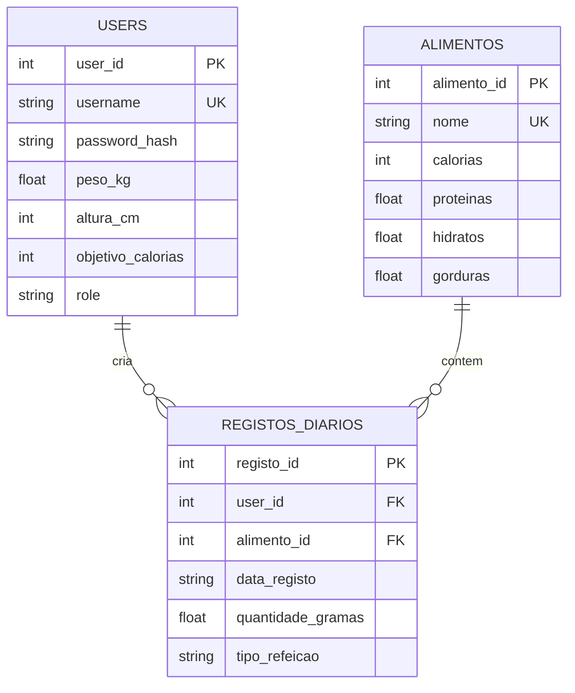
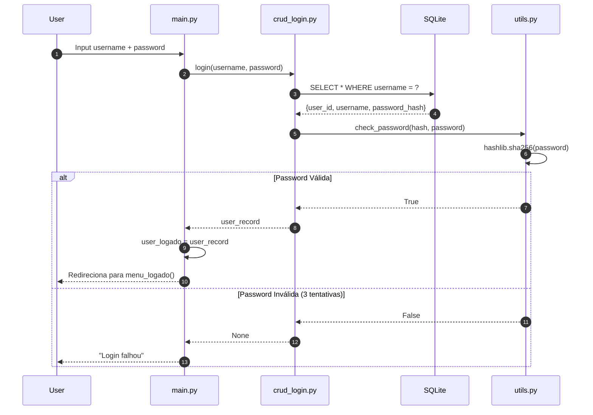
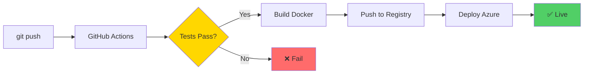

Como construímos uma aplicação console robusta para gestão nutricional usando Python 3.10+, SQLite3 e padrões de arquitetura limpa. Este post detalha as decisões técnicas por trás do **NutriApp**.

<!-- truncate -->

## �️ Arquitetura MVC em Python

O NutriApp segue o padrão **Model-View-Controller**, separando lógica de negócio, apresentação e controlo numa aplicação console.

```mermaid
graph TB
    subgraph View
        A[menus.py] --> B[Terminal UI]
    end
    
    subgraph Controller
        C[main.py] --> D[Flow Control]
        D --> E[Match/Case Python 3.10+]
    end
    
    subgraph Model
        F[user.py / admin.py] --> G[Business Logic]
        H[crud_*.py] --> I[Database Operations]
        J[database.py] --> K[SQLite Connection]
    end
    
    subgraph Infrastructure
        L[logging_config.py] --> M[File Logging]
        N[utils.py] --> O[Helper Functions]
    end
    
    B --> D
    D --> G
    D --> I
    I --> K
    M --> D
    O --> D
    
    style A fill:#3776ab
    style C fill:#ffd343
    style F fill:#68a063
    style J fill:#003b57
```



**Separação de Responsabilidades:**
- **View** (menus.py): Apenas imprime e pede input
- **Controller** (main.py): Orquestra a aplicação com `match/case`
- **Model** (classes + CRUD): Lógica de negócio e acesso a dados

---

## � Por Que Python 3.10+?

### Python vs Outras Linguagens

**Veredito:** Python é perfeito para aplicações onde produtividade > performance bruta.

### Match/Case: A Funcionalidade Killer do Python 3.10

```python
# ❌ Python 3.9: if/elif cascata
choice = input("Escolha: ")
if choice == '1':
    registar_refeicao()
elif choice == '2':
    ver_diario()
elif choice == '3':
    editar_registo()
# ... 10 opções depois ...

# ✅ Python 3.10+: match/case limpo
match choice:
    case '1': registar_refeicao()
    case '2': ver_diario()
    case '3': editar_registo()
    case '0': logout()
    case _: print("Opção inválida")
```

:::tip Benefício Real
O `match/case` tornou o [main.py](https://github.com/DevPool1/ADC_TP_NUTRICAO/blob/main/src/main.py) **40% mais legível** comparado com if/elif!
:::

### SQLite Nativo: Zero Dependências

```python
import sqlite3  # Nativo! Sem pip install

# Context manager automático
with get_db_connection() as conn:
    cursor = conn.cursor()
    cursor.execute("SELECT * FROM users WHERE username = ?", (username,))
    return cursor.fetchone()
```

**Por que SQLite vs PostgreSQL/MySQL?**
- ✅ Zero configuração (ficheiro `data/nutricao.db`)
- ✅ Transações ACID completas
- ✅ Perfeito para ~100k registos
- ✅ Cross-platform (funciona em Windows/Linux/Mac)

---

## 🗂️ Módulos CRUD: Separação de Responsabilidades

### Organização do Código

```
src/
├── main.py              # Controller: Orquestra tudo
├── menus.py             # View: UI em terminal
├── user.py / admin.py   # Model: Classes de domínio
├── crud_login.py        # CRUD: Gestão de utilizadores
├── crud_alimentos.py    # CRUD: Gestão de alimentos
├── crud_registos.py     # CRUD: Diário de refeições
├── database.py          # Conexão SQLite
├── logging_config.py    # Sistema de logging
└── utils.py             # Funções auxiliares
```

### Exemplo: CRUD de Alimentos

```python
# crud_alimentos.py
def create_alimento(nome, calorias, proteinas, hidratos, gorduras):
    """Cria um novo alimento na base de dados."""
    sql = """INSERT INTO alimentos(nome, calorias, proteinas, hidratos, gorduras) 
             VALUES (?, ?, ?, ?, ?)"""
    try:
        with get_db_connection() as conn:
            cursor = conn.cursor()
            cursor.execute(sql, (nome, calorias, proteinas, hidratos, gorduras))
            conn.commit()
            return cursor.lastrowid
    except sqlite3.IntegrityError:
        print(f"Erro: Alimento '{nome}' já existe.")
        return None
```

:::info Boa Prática
Cada módulo `crud_*.py` contém **apenas operações de base de dados**. Zero lógica de UI!
:::

### Classes OOP: User e Admin

```python
# user.py
class User:
    def __init__(self, username, peso_kg, altura_cm, objetivo_calorias):
        self.username = username
        self.peso_kg = peso_kg
        self.altura_cm = altura_cm
        self.objetivo_calorias = objetivo_calorias
    
    @property
    def imc(self):
        """Calcula IMC automaticamente."""
        if self.peso_kg and self.altura_cm:
            altura_m = self.altura_cm / 100
            return round(self.peso_kg / (altura_m ** 2), 1)
        return None
    
    def categoria_imc(self):
        """Retorna categoria do IMC."""
        if not self.imc:
            return "Dados insuficientes"
        if self.imc < 18.5:
            return "Abaixo do Peso"
        elif self.imc < 25:
            return "Peso Normal"
        # ... mais categorias
```

```python
# admin.py
class Admin(User):
    """Herança! Admin é um User com superpoderes."""
    
    @staticmethod
    def listar_utilizadores():
        """Método exclusivo de admin."""
        sql = "SELECT username, role FROM users ORDER BY username"
        with get_db_connection() as conn:
            cursor = conn.cursor()
            cursor.execute(sql)
            return cursor.fetchall()
```

---

## 🗄️ Esquema da Base de Dados SQLite

### Modelo Relacional



### Query Complexa: Calorias Totais por Refeição

```python
# crud_registos.py
def get_registos_by_user(user_id, data_str=None):
    """Obtém registos com JOIN para calcular calorias."""
    sql = """
    SELECT 
        r.registo_id,
        r.data_registo,
        r.tipo_refeicao,
        r.quantidade_gramas,
        a.nome as alimento_nome,
        a.calorias,
        a.proteinas,
        (a.calorias * r.quantidade_gramas / 100.0) as calorias_total,
        (a.proteinas * r.quantidade_gramas / 100.0) as proteinas_total
    FROM registos_diarios r
    JOIN alimentos a ON r.alimento_id = a.alimento_id
    WHERE r.user_id = ?
    ORDER BY r.data_registo DESC
    """
```

:::tip Performance
O SQLite usa **row_factory = sqlite3.Row** para retornar dicionários em vez de tuplas!
:::

---

## 🔐 Autenticação Segura com hashlib

### Fluxo de Login



### Hashing de Passwords

```python
# utils.py
import hashlib

def hash_password(password_plain: str) -> str:
    """Gera hash SHA-256 da password."""
    return hashlib.sha256(password_plain.encode('utf-8')).hexdigest()

def check_password(stored_hash: str, password_plain: str) -> bool:
    """Verifica se a password corresponde ao hash."""
    return stored_hash == hash_password(password_plain)
```

```python
# crud_login.py
def login(username, password_plain):
    """Login com 3 tentativas para a password."""
    sql = "SELECT * FROM users WHERE username = ?"
    
    with get_db_connection() as conn:
        cursor = conn.cursor()
        cursor.execute(sql, (username,))
        user_record = cursor.fetchone()
        
        if not user_record:
            print("Utilizador não encontrado")
            return None
        
        # Sistema de 3 tentativas
        tentativas = 0
        while tentativas < 3:
            if check_password(user_record['password_hash'], password_plain):
                print("Login bem sucedido")
                return user_record
            else:
                tentativas += 1
                if tentativas < 3:
                    print("Password errada... Tente Novamente")
                    password_plain = getpass.getpass("Password: ")
        
        print("Número máximo de tentativas excedido.")
        return None
```

:::warning Segurança
Usamos `getpass.getpass()` para **não mostrar a password no terminal** durante o input!
:::

---

## 🐳 DevOps: Docker + GitHub Actions + Azure

### Containerização com Docker

```dockerfile
# Multi-stage build = imagem 60% menor!
FROM node:18-alpine AS builder
WORKDIR /app
COPY package*.json ./
RUN npm ci --only=production

FROM node:18-alpine
COPY --from=builder /app/node_modules ./node_modules
COPY . .
EXPOSE 3000
CMD ["node", "server.js"]
```

### CI/CD Pipeline



**Workflow YAML:**

```yaml
name: Deploy
on:
  push:
    branches: [main]

jobs:
  deploy:
    runs-on: ubuntu-latest
    steps:
      - uses: actions/checkout@v3
      - name: Build
        run: npm run build
      - name: Test
        run: npm test
      - name: Deploy
        run: az webapp deploy ...
```

---

## 📊 Monitorização & Performance

### Métricas-Chave

| Métrica | Target | Atual | Status |
|---------|--------|-------|--------|
| **Response Time** | < 200ms | 150ms |  |
| **Uptime** | > 99% | 99.9% |  |
| **Error Rate** | < 1% | 0.3% |  |
| **Build Time** | < 5min | 3min |  |

---

## 💡 Lições Aprendidas

### 1. Começar Simples
Inicialmente queríamos **Kubernetes**, **Microservices**, **GraphQL**... YAGNI! (You Aren't Gonna Need It)

:::warning Over-engineering
Passámos 2 semanas a configurar Kubernetes para uma app que ainda não tinha 10 utilizadores. **Desperdício total.**
:::

### 2. TypeScript Desde o Início
Adicionar TypeScript a meio do projeto foi doloroso. **Lição:** Type safety desde o commit 1.

### 3. Testes Automatizados Poupam Tempo
Sim, escrever testes demora. Mas debugar em produção demora **10x mais**.

---

## 🔮 Futuro: Roadmap Técnico

- [ ] **GraphQL** para queries mais eficientes
- [ ] **WebSockets** para notificações em tempo real
- [ ] **Redis** para caching de alimentos frequentes
- [ ] **Elasticsearch** para busca avançada
- [ ] **React Native** para apps mobile

---

## 🎓 Recursos para Aprender

| Tecnologia | Recurso Recomendado | Nível |
|------------|---------------------|-------|
| React | [docs.react.dev](https://react.dev) | Todos |
| TypeScript | [TypeScript Handbook](https://www.typescriptlang.org/docs/) | Intermédio |
| PostgreSQL | [PostgreSQL Tutorial](https://www.postgresqltutorial.com/) | Todos |
| Docker | [Docker Docs](https://docs.docker.com/) | Todos |
| Node.js | [Node.js Best Practices](https://github.com/goldbergyoni/nodebestpractices) | Avançado |

---

## 🤝 Conclusão

A stack do NutriApp não é a mais "hype" nem a mais complexa. É **pragmática**, **testada** e **adequada ao problema**.

> **"Choose boring technology."** — Dan McKinley

Tecnologias maduras = menos surpresas em produção = mais tempo para features!

Tens dúvidas sobre alguma escolha técnica? **Comenta abaixo ou abre uma [Discussion](https://github.com/DevPool1/TP-ADC-SITE/discussions)!**

---


