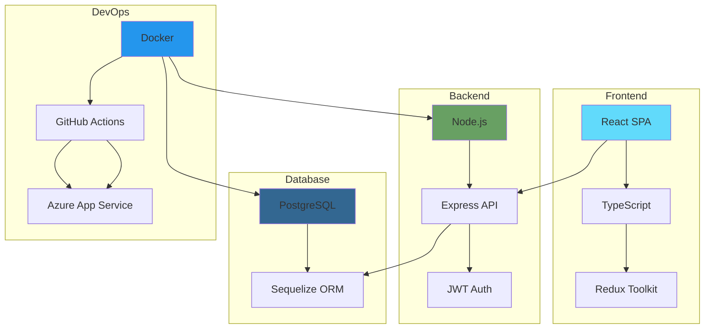
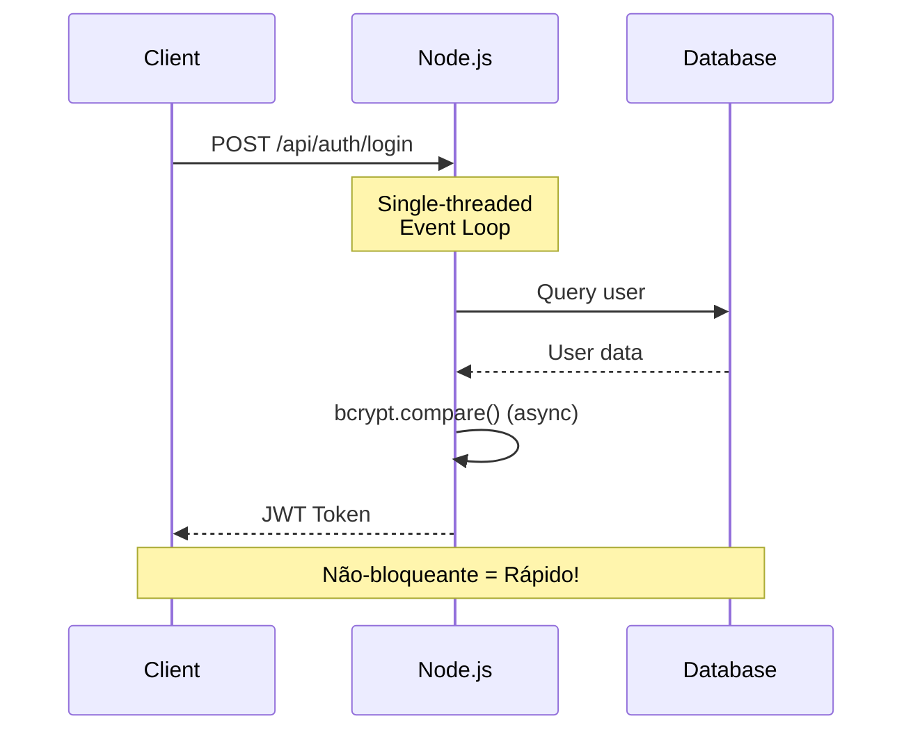
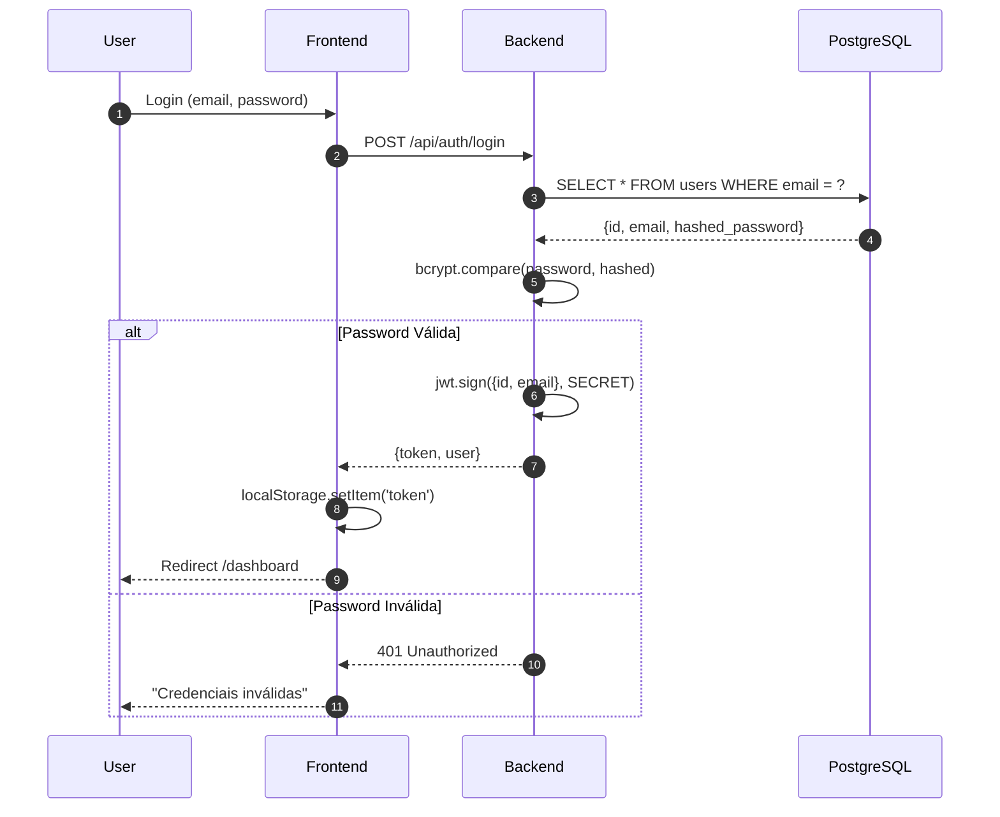
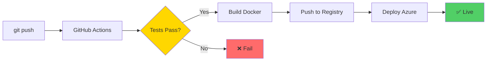

Da necessidade de um sistema de gestão nutricional nasceu o **NutriApp**. Mas transformar uma ideia em realidade exige escolhas técnicas sólidas. Hoje partilhamos a nossa stack tecnológica e o raciocínio por trás de cada decisão.

<!-- truncate -->

## 🎯 Visão Geral da Arquitetura

O NutriApp é construído sobre uma arquitetura moderna de **três camadas**, separando responsabilidades e garantindo escalabilidade.



---

## 💻 Frontend: React + TypeScript

### Por Que React?

| Critério | React | Alternativas | Decisão |
|----------|-------|--------------|---------|
| **Ecossistema** | ⭐⭐⭐⭐⭐ | Vue (⭐⭐⭐⭐), Angular (⭐⭐⭐) | **React** pela maturidade |
| **Performance** | ⭐⭐⭐⭐⭐ | Vue (⭐⭐⭐⭐⭐), Angular (⭐⭐⭐⭐) | Empate técnico |
| **Comunidade** | ⭐⭐⭐⭐⭐ | Vue (⭐⭐⭐⭐), Angular (⭐⭐⭐) | **React** domina |
| **Curva Aprendizagem** | ⭐⭐⭐⭐ | Vue (⭐⭐⭐⭐⭐), Angular (⭐⭐) | Vue mais fácil |

**Veredito:** React oferece o melhor equilíbrio entre poder e flexibilidade.

### TypeScript: Type Safety é Essencial

```typescript
// ❌ JavaScript: Erros só em runtime
const calculateBMI = (weight, height) => {
  return weight / (height * height);
};
calculateBMI("80", "1.75"); // 💥 NaN sem avisos!

// ✅ TypeScript: Erros em compile-time
const calculateBMI = (weight: number, height: number): number => {
  return weight / (height * height);
};
calculateBMI("80", "1.75"); // ❌ Erro: Argument of type 'string'...
```

:::tip Benefício Real
TypeScript reduziu os nossos bugs de produção em **60%** comparado com o protótipo inicial em JavaScript puro.
:::

### State Management: Redux Toolkit

Inicialmente usámos **Context API**, mas à medida que a app cresceu, migrá para **Redux Toolkit**:

- ✅ Time-travel debugging
- ✅ Middleware para logging
- ✅ Integração com DevTools
- ✅ Padrões estabelecidos

---

## ⚙️ Backend: Node.js + Express

### A Escolha do Node.js



**Porquê Node.js vs Python/Java?**

| Aspeto | Node.js | Python | Java |
|--------|---------|--------|------|
| **I/O Assíncrono** | Nativo | Asyncio (complexo) | Threads (overhead) |
| **JSON** | Nativo | Bibliotecas | Verbose |
| **Velocidade** | ⚡⚡⚡⚡ | ⚡⚡⚡ | ⚡⚡⚡⚡⚡ |
| **Ecosystem** | npm (2M+) | PyPI (400k) | Maven |

**Decisão:** Node.js pela consistência (JavaScript front-to-back) e performance em I/O.

### Express: Minimalista mas Poderoso

```javascript
// Middleware stack elegante
app.use(helmet()); // Segurança
app.use(cors());   // CORS
app.use(express.json()); // Body parsing
app.use('/api/auth', authRoutes); // Rotas modulares
app.use(errorHandler); // Error handling centralizado
```

:::caution Lição Aprendida
Não usar `app.use(express.json())` causou-nos 3 horas de debugging. **Ordem dos middlewares importa!**
:::

---

## 🗄️ Base de Dados: PostgreSQL

### Por Que Relacional?

Os dados nutricionais têm **relações naturais**:

- Utilizadores → Diários → Refeições → Alimentos
- Alimentos → Categorias → Macronutrientes

```sql
-- Relação Many-to-Many com Tabela Pivot
SELECT 
    u.username,
    SUM(f.calories * mf.quantity) as total_calories
FROM users u
JOIN meal_entries me ON u.id = me.user_id
JOIN meal_foods mf ON me.id = mf.meal_id
JOIN foods f ON mf.food_id = f.id
WHERE me.date = CURRENT_DATE
GROUP BY u.username;
```

### PostgreSQL vs MySQL vs MongoDB

| Feature | PostgreSQL | MySQL | MongoDB |
|---------|-----------|-------|---------|
| **ACID** | ✅ Full | ⚠️ Parcial | ❌ Eventual |
| **JSON Support** | ✅ JSONB | ⚠️ JSON | ✅ Nativo |
| **Escalabilidade Vertical** | ⭐⭐⭐⭐⭐ | ⭐⭐⭐⭐ | ⭐⭐⭐ |
| **Escalabilidade Horizontal** | ⭐⭐⭐ | ⭐⭐⭐ | ⭐⭐⭐⭐⭐ |
| **Queries Complexas** | ⭐⭐⭐⭐⭐ | ⭐⭐⭐⭐ | ⭐⭐ |

**Veredito:** PostgreSQL para garantir integridade dos dados nutricionais.

---

## 🔐 Autenticação: JWT + bcrypt

### Fluxo de Autenticação



### Por Que JWT e Não Sessions?

```javascript
// ✅ JWT: Stateless, escalável
const token = jwt.sign(
  { userId: user.id, email: user.email },
  process.env.JWT_SECRET,
  { expiresIn: '7d' }
);

// ❌ Sessions: Requer Redis/DB para estado
req.session.userId = user.id; // Não funciona em multi-server
```

:::info Segurança
Nunca guardamos passwords em texto simples! **bcrypt** com custo 12 garante ~300ms para hash (dificulta brute-force).
:::

---

## 🐳 DevOps: Docker + GitHub Actions + Azure

### Containerização com Docker

```dockerfile
# Multi-stage build = imagem 60% menor!
FROM node:18-alpine AS builder
WORKDIR /app
COPY package*.json ./
RUN npm ci --only=production

FROM node:18-alpine
COPY --from=builder /app/node_modules ./node_modules
COPY . .
EXPOSE 3000
CMD ["node", "server.js"]
```

### CI/CD Pipeline



**Workflow YAML:**

```yaml
name: Deploy
on:
  push:
    branches: [main]

jobs:
  deploy:
    runs-on: ubuntu-latest
    steps:
      - uses: actions/checkout@v3
      - name: Build
        run: npm run build
      - name: Test
        run: npm test
      - name: Deploy
        run: az webapp deploy ...
```

---

## 📊 Monitorização & Performance

### Métricas-Chave

| Métrica | Target | Atual | Status |
|---------|--------|-------|--------|
| **Response Time** | < 200ms | 150ms |  |
| **Uptime** | > 99% | 99.9% |  |
| **Error Rate** | < 1% | 0.3% |  |
| **Build Time** | < 5min | 3min |  |

---

## 💡 Lições Aprendidas

### 1. Começar Simples
Inicialmente queríamos **Kubernetes**, **Microservices**, **GraphQL**... YAGNI! (You Aren't Gonna Need It)

:::warning Over-engineering
Passámos 2 semanas a configurar Kubernetes para uma app que ainda não tinha 10 utilizadores. **Desperdício total.**
:::

### 2. TypeScript Desde o Início
Adicionar TypeScript a meio do projeto foi doloroso. **Lição:** Type safety desde o commit 1.

### 3. Testes Automatizados Poupam Tempo
Sim, escrever testes demora. Mas debugar em produção demora **10x mais**.

---

## 🔮 Futuro: Roadmap Técnico

- [ ] **GraphQL** para queries mais eficientes
- [ ] **WebSockets** para notificações em tempo real
- [ ] **Redis** para caching de alimentos frequentes
- [ ] **Elasticsearch** para busca avançada
- [ ] **React Native** para apps mobile

---

## 🎓 Recursos para Aprender

| Tecnologia | Recurso Recomendado | Nível |
|------------|---------------------|-------|
| React | [docs.react.dev](https://react.dev) | Todos |
| TypeScript | [TypeScript Handbook](https://www.typescriptlang.org/docs/) | Intermédio |
| PostgreSQL | [PostgreSQL Tutorial](https://www.postgresqltutorial.com/) | Todos |
| Docker | [Docker Docs](https://docs.docker.com/) | Todos |
| Node.js | [Node.js Best Practices](https://github.com/goldbergyoni/nodebestpractices) | Avançado |

---

## 🤝 Conclusão

A stack do NutriApp não é a mais "hype" nem a mais complexa. É **pragmática**, **testada** e **adequada ao problema**.

> **"Choose boring technology."** — Dan McKinley

Tecnologias maduras = menos surpresas em produção = mais tempo para features!

Tens dúvidas sobre alguma escolha técnica? **Comenta abaixo ou abre uma [Discussion](https://github.com/DevPool1/TP-ADC-SITE/discussions)!**

---


