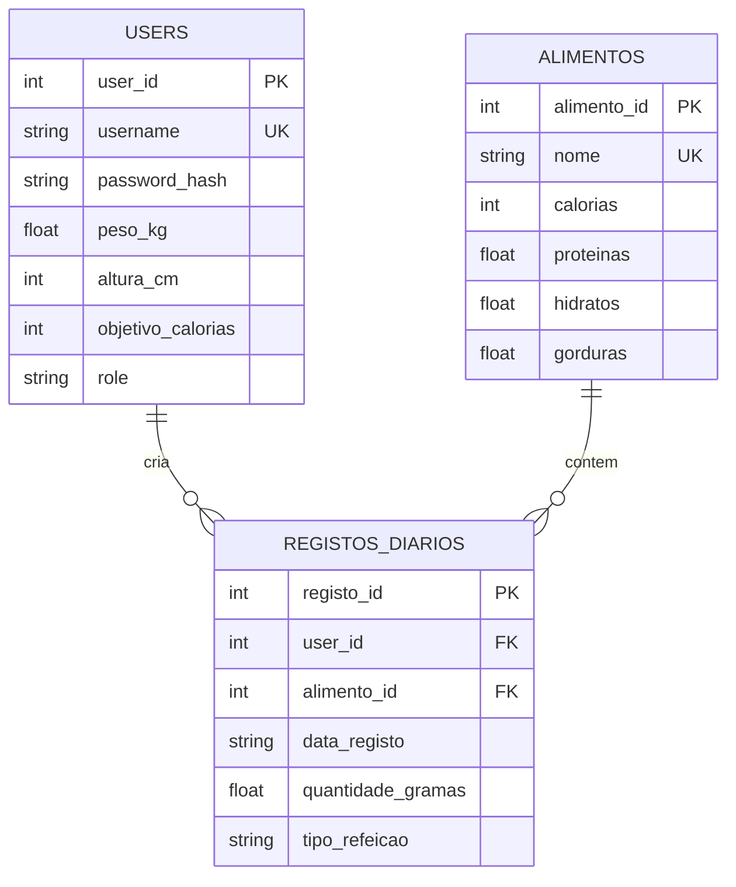
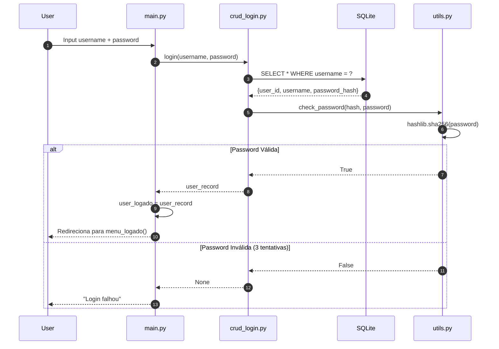

Como construímos uma aplicação console robusta para gestão nutricional usando Python 3.10+, SQLite3 e padrões de arquitetura limpa. Este post detalha as decisões técnicas por trás do **NutriApp**.

<!-- truncate -->

## �️ Arquitetura MVC em Python

O NutriApp segue o padrão **Model-View-Controller**, separando lógica de negócio, apresentação e controlo numa aplicação console.


```mermaid
graph TB
    subgraph View
        A[menus.py] --> B[Terminal UI]
    end
    
    subgraph Controller
        C[main.py] --> D[Flow Control]
        D --> E[Match/Case Python 3.10+]
    end
    
    subgraph Model
        F[user.py / admin.py] --> G[Business Logic]
        H[crud_*.py] --> I[Database Operations]
        J[database.py] --> K[SQLite Connection]
    end
    
    subgraph Infrastructure
        L[logging_config.py] --> M[File Logging]
        N[utils.py] --> O[Helper Functions]
    end
    
    B --> D
    D --> G
    D --> I
    I --> K
    M --> D
    O --> D
    
    style A fill:#3776ab
    style C fill:#ffd343
    style F fill:#68a063
    style J fill:#003b57
```

**Separação de Responsabilidades:**
- **View** (menus.py): Apenas imprime e pede input
- **Controller** (main.py): Orquestra a aplicação com `match/case`
- **Model** (classes + CRUD): Lógica de negócio e acesso a dados

---

## � Por Que Python 3.10+?

### Python vs Outras Linguagens

**Veredito:** Python é perfeito para aplicações onde produtividade > performance bruta.

### Match/Case: A Funcionalidade Killer do Python 3.10

```python
# ❌ Python 3.9: if/elif cascata
choice = input("Escolha: ")
if choice == '1':
    registar_refeicao()
elif choice == '2':
    ver_diario()
elif choice == '3':
    editar_registo()
# ... 10 opções depois ...

# ✅ Python 3.10+: match/case limpo
match choice:
    case '1': registar_refeicao()
    case '2': ver_diario()
    case '3': editar_registo()
    case '0': logout()
    case _: print("Opção inválida")
```

:::tip Benefício Real
O `match/case` tornou o [main.py](https://github.com/DevPool1/ADC_TP_NUTRICAO/blob/main/src/main.py) **40% mais legível** comparado com if/elif!
:::

### SQLite Nativo: Zero Dependências

```python
import sqlite3  # Nativo! Sem pip install

# Context manager automático
with get_db_connection() as conn:
    cursor = conn.cursor()
    cursor.execute("SELECT * FROM users WHERE username = ?", (username,))
    return cursor.fetchone()
```

**Por que SQLite vs PostgreSQL/MySQL?**
- ✅ Zero configuração (ficheiro `data/nutricao.db`)
- ✅ Transações ACID completas
- ✅ Perfeito para ~100k registos
- ✅ Cross-platform (funciona em Windows/Linux/Mac)

---

## 🗂️ Módulos CRUD: Separação de Responsabilidades

### Organização do Código

```
src/
├── main.py              # Controller: Orquestra tudo
├── menus.py             # View: UI em terminal
├── user.py / admin.py   # Model: Classes de domínio
├── crud_login.py        # CRUD: Gestão de utilizadores
├── crud_alimentos.py    # CRUD: Gestão de alimentos
├── crud_registos.py     # CRUD: Diário de refeições
├── database.py          # Conexão SQLite
├── logging_config.py    # Sistema de logging
└── utils.py             # Funções auxiliares
```

### Exemplo: CRUD de Alimentos

```python
# crud_alimentos.py
def create_alimento(nome, calorias, proteinas, hidratos, gorduras):
    """Cria um novo alimento na base de dados."""
    sql = """INSERT INTO alimentos(nome, calorias, proteinas, hidratos, gorduras) 
             VALUES (?, ?, ?, ?, ?)"""
    try:
        with get_db_connection() as conn:
            cursor = conn.cursor()
            cursor.execute(sql, (nome, calorias, proteinas, hidratos, gorduras))
            conn.commit()
            return cursor.lastrowid
    except sqlite3.IntegrityError:
        print(f"Erro: Alimento '{nome}' já existe.")
        return None
```

:::info Boa Prática
Cada módulo `crud_*.py` contém **apenas operações de base de dados**. Zero lógica de UI!
:::

### Classes OOP: User e Admin

```python
# user.py
class User:
    def __init__(self, username, peso_kg, altura_cm, objetivo_calorias):
        self.username = username
        self.peso_kg = peso_kg
        self.altura_cm = altura_cm
        self.objetivo_calorias = objetivo_calorias
    
    @property
    def imc(self):
        """Calcula IMC automaticamente."""
        if self.peso_kg and self.altura_cm:
            altura_m = self.altura_cm / 100
            return round(self.peso_kg / (altura_m ** 2), 1)
        return None
    
    def categoria_imc(self):
        """Retorna categoria do IMC."""
        if not self.imc:
            return "Dados insuficientes"
        if self.imc < 18.5:
            return "Abaixo do Peso"
        elif self.imc < 25:
            return "Peso Normal"
        # ... mais categorias
```

```python
# admin.py
class Admin(User):
    """Herança! Admin é um User com superpoderes."""
    
    @staticmethod
    def listar_utilizadores():
        """Método exclusivo de admin."""
        sql = "SELECT username, role FROM users ORDER BY username"
        with get_db_connection() as conn:
            cursor = conn.cursor()
            cursor.execute(sql)
            return cursor.fetchall()
```

---

## 🗄️ Esquema da Base de Dados SQLite

### Modelo Relacional


```mermaid
erDiagram
    USERS ||--o{ REGISTOS_DIARIOS : cria
    ALIMENTOS ||--o{ REGISTOS_DIARIOS : contem
    
    USERS {
        int user_id PK
        string username UK
        string password_hash
        float peso_kg
        int altura_cm
        int objetivo_calorias
        string role
    }
    
    ALIMENTOS {
        int alimento_id PK
        string nome UK
        int calorias
        float proteinas
        float hidratos
        float gorduras
    }
    
    REGISTOS_DIARIOS {
        int registo_id PK
        int user_id FK
        int alimento_id FK
        string data_registo
        float quantidade_gramas
        string tipo_refeicao
    }
```

### Query Complexa: Calorias Totais por Refeição

```python
# crud_registos.py
def get_registos_by_user(user_id, data_str=None):
    """Obtém registos com JOIN para calcular calorias."""
    sql = """
    SELECT 
        r.registo_id,
        r.data_registo,
        r.tipo_refeicao,
        r.quantidade_gramas,
        a.nome as alimento_nome,
        a.calorias,
        a.proteinas,
        (a.calorias * r.quantidade_gramas / 100.0) as calorias_total,
        (a.proteinas * r.quantidade_gramas / 100.0) as proteinas_total
    FROM registos_diarios r
    JOIN alimentos a ON r.alimento_id = a.alimento_id
    WHERE r.user_id = ?
    ORDER BY r.data_registo DESC
    """
```

:::tip Performance
O SQLite usa **row_factory = sqlite3.Row** para retornar dicionários em vez de tuplas!
:::

---

## 🔐 Autenticação Segura com hashlib

### Fluxo de Login


```mermaid
sequenceDiagram
    autonumber
    participant U as User
    participant M as main.py
    participant C as crud_login.py
    participant DB as SQLite
    participant H as utils.py
    
    U->>M: Input username + password
    M->>C: login(username, password)
    C->>DB: SELECT * WHERE username = ?
    DB-->>C: {user_id, username, password_hash}
    C->>H: check_password(hash, password)
    H->>H: hashlib.sha256(password)
    
    alt Password Válida
        H-->>C: True
        C-->>M: user_record
        M->>M: user_logado = user_record
        M-->>U: Redireciona para menu_logado()
    else Password Inválida (3 tentativas)
        H-->>C: False
        C-->>M: None
        M-->>U: "Login falhou"
    end
```

### Hashing de Passwords

```python
# utils.py
import hashlib

def hash_password(password_plain: str) -> str:
    """Gera hash SHA-256 da password."""
    return hashlib.sha256(password_plain.encode('utf-8')).hexdigest()

def check_password(stored_hash: str, password_plain: str) -> bool:
    """Verifica se a password corresponde ao hash."""
    return stored_hash == hash_password(password_plain)
```

```python
# crud_login.py
def login(username, password_plain):
    """Login com 3 tentativas para a password."""
    sql = "SELECT * FROM users WHERE username = ?"
    
    with get_db_connection() as conn:
        cursor = conn.cursor()
        cursor.execute(sql, (username,))
        user_record = cursor.fetchone()
        
        if not user_record:
            print("Utilizador não encontrado")
            return None
        
        # Sistema de 3 tentativas
        tentativas = 0
        while tentativas < 3:
            if check_password(user_record['password_hash'], password_plain):
                print("Login bem sucedido")
                return user_record
            else:
                tentativas += 1
                if tentativas < 3:
                    print("Password errada... Tente Novamente")
                    password_plain = getpass.getpass("Password: ")
        
        print("Número máximo de tentativas excedido.")
        return None
```

:::warning Segurança
Usamos `getpass.getpass()` para **não mostrar a password no terminal** durante o input!
:::

---

## � Sistema de Logging com Módulo Nativo

### Por Que Logging?

Numa aplicação console **não temos DevTools do browser**. O logging é crucial para:
- Auditoria de ações de utilizadores
- Debugging de erros em produção
- Conformidade com requisitos de segurança

### Configuração Centralizada

```python
# logging_config.py
import logging
import datetime
import os

def setup_logging():
    """Configura logging com rotação diária."""
    log_dir = "logs"
    os.makedirs(log_dir, exist_ok=True)
    
    log_file = f"{log_dir}/nutriapp_{datetime.date.today()}.log"
    
    logging.basicConfig(
        level=logging.INFO,
        format='%(asctime)s - %(name)s - %(levelname)s - %(message)s',
        handlers=[
            logging.FileHandler(log_file),
        ]
    )

def get_logger(name):
    """Retorna logger configurado."""
    return logging.getLogger(name)
```

### Uso no Código

```python
# main.py
import logging_config

def main():
    logging_config.setup_logging()
    logger = logging_config.get_logger(__name__)
    
    logger.info("Sistema iniciado")
    
    # ... código ...
    
    if user_logado:
        logger.info(f"Login sucesso. UserID: {user_id}, Username: {username}")
    else:
        logger.warning(f"Login falhado para username: {username}")
```

**Output em `logs/nutriapp_2025-12-13.log`:**
```
2025-12-13 10:23:45 - __main__ - INFO - Sistema iniciado
2025-12-13 10:24:12 - __main__ - INFO - Login sucesso. UserID: 5, Username: andre
2025-12-13 10:25:03 - __main__ - INFO - Menu User. UserID: 5. Detalhes: Registou refeição: Almoço
```

:::info Boa Prática
Logs **nunca** armazenam passwords! Apenas eventos e identificadores.
:::

---

## � Funcionalidades Avançadas

### 1. Operações em Lote (Admin)

```python
# admin.py
@staticmethod
def inserir_em_lote():
    """Insere múltiplos alimentos de uma vez."""
    print("Formato: nome,calorias,proteinas,hidratos,gorduras,nome,...")
    lote = input("Dados>>> ")
    dados = [x.strip() for x in lote.split(",")]
    
    if len(dados) % 5 != 0:
        print("Erro: formato inválido")
        return
    
    lote_dados = []
    for i in range(0, len(dados), 5):
        nome = dados[i]
        calorias = int(dados[i+1])
        proteinas = float(dados[i+2])
        hidratos = float(dados[i+3])
        gorduras = float(dados[i+4])
        lote_dados.append((nome, calorias, proteinas, hidratos, gorduras))
    
    sql = """INSERT OR IGNORE INTO alimentos 
             (nome, calorias, proteinas, hidratos, gorduras)
             VALUES (?, ?, ?, ?, ?)"""
    
    with get_db_connection() as conn:
        cursor = conn.cursor()
        cursor.executemany(sql, lote_dados)  # Batch insert!
        conn.commit()
```

:::tip Performance
`executemany()` é **10x mais rápido** que múltiplos `execute()` individuais!
:::

### 2. Agrupamento de Refeições por Data

```python
# main.py - Lógica de agrupamento no controller
registos = crud_registos.get_registos_by_user(user_id_logado)

refeicoes_agrupadas = {}
for reg in registos:
    data_limpa = reg['data_registo'].split('T')[0]  # 2025-12-13
    chave = f"{data_limpa} | {reg['tipo_refeicao']}"  # "2025-12-13 | Almoço"
    
    if chave not in refeicoes_agrupadas:
        refeicoes_agrupadas[chave] = []
    refeicoes_agrupadas[chave].append(reg)

# Output organizado por refeição
for refeicao_titulo, lista_items in refeicoes_agrupadas.items():
    print(f"\nREFEIÇÃO: {refeicao_titulo}")
    subtotal_cal = 0
    
    for reg in lista_items:
        print(f"- {reg['alimento_nome']} ({reg['quantidade_gramas']}g) -> {reg['calorias_total']:.1f} kcal")
        subtotal_cal += reg['calorias_total']
    
    print(f"Subtotal: {subtotal_cal:.1f} kcal")
```

### 3. Cálculo Automático de IMC

```python
# user.py
@property
def imc(self):
    """Property dinâmica - calcula sempre que acedida."""
    if self.peso_kg and self.altura_cm:
        altura_m = self.altura_cm / 100
        return round(self.peso_kg / (altura_m ** 2), 1)
    return None

def categoria_imc(self):
    """Retorna categoria baseada em guidelines WHO."""
    if not self.imc:
        return "Dados insuficientes"
    if self.imc < 18.5:
        return "Abaixo do Peso"
    elif self.imc < 25:
        return "Peso Normal"
    elif self.imc < 30:
        return "Sobrepeso"
    else:
        return "Obesidade"
```

---

## 💡 Lições Aprendidas

### 1. Match/Case é Game Changer
Inicialmente usámos `if/elif` cascatas. Refactorizar para `match/case` melhorou a legibilidade drasticamente.

```python
# ❌ Antes: 100 linhas de if/elif
if choice == '1':
    # 20 linhas
elif choice == '2':
    # 15 linhas
# ... ad nauseam

# ✅ Depois: Estrutura clara
match choice:
    case '1': registar_refeicao()
    case '2': ver_diario()
    # Cada função < 50 linhas
```

### 2. Context Managers Previnem Leaks

```python
# ❌ Má prática: Esquecer de fechar
conn = sqlite3.connect(DB_PATH)
cursor = conn.cursor()
cursor.execute(sql)
# Oops! Esqueci conn.close()

# ✅ Boa prática: Automático
with get_db_connection() as conn:
    cursor = conn.cursor()
    cursor.execute(sql)
    # conn.close() chamado automaticamente!
```

### 3. Docstrings São Documentação Viva

Usámos **Sphinx** para gerar documentação HTML automática:

```python
def create_user(username, password_plain, peso_kg=None, altura_cm=None):
    """
    Cria novo utilizador na base de dados.

    :param username: Nome do utilizador
    :type username: str
    :param password_plain: Password em texto simples (será hasheada)
    :type password_plain: str
    :param peso_kg: Peso em quilogramas
    :type peso_kg: float
    :return: ID do utilizador criado ou None se já existir
    :rtype: int or None
    """
```

**Resultado:** Documentação completa em `docs/_build/html/index.html`

:::tip Produtividade
Docstrings bem escritas pouparam-nos **horas** a explicar o código à equipa!
:::

---

## 🔮 Roadmap: De Console para Web

### Fase 1: API REST (Em Progresso)
- [ ] FastAPI backend preservando lógica CRUD
- [ ] Endpoints: `/api/auth`, `/api/foods`, `/api/meals`
- [ ] Migração SQLite → PostgreSQL
- [ ] Autenticação com JWT

### Fase 2: Frontend React
- [ ] Interface web responsiva
- [ ] Dashboard com gráficos de calorias
- [ ] Busca de alimentos em tempo real
- [ ] PWA para uso offline

### Fase 3: Features Avançadas
- [ ] Análise nutricional com machine learning
- [ ] Integração com APIs de alimentos (USDA, Open Food Facts)
- [ ] Exportação de dados em PDF
- [ ] App mobile com React Native

---

## 🎓 Recursos para Aprender

| Tecnologia | Recurso Recomendado | Nível |
|------------|---------------------|-------|
| Python 3.10+ | [docs.python.org](https://docs.python.org/3/) | Todos |
| SQLite | [SQLite Tutorial](https://www.sqlitetutorial.net/) | Todos |
| Arquitetura MVC | [Real Python - MVC](https://realpython.com/the-model-view-controller-mvc-paradigm-summarized-with-legos/) | Intermédio |
| Sphinx Docs | [Sphinx Documentation](https://www.sphinx-doc.org/) | Intermédio |
| Git Flow | [Atlassian Git Flow](https://www.atlassian.com/git/tutorials/comparing-workflows/gitflow-workflow) | Todos |

---

## 🤝 Conclusão

A stack do NutriApp não é a mais "hype" nem a mais complexa. É **pragmática**, **testada** e **adequada ao problema**.

> **"Choose boring technology."** — Dan McKinley

Tecnologias maduras = menos surpresas em produção = mais tempo para features!

Tens dúvidas sobre alguma escolha técnica? **Comenta abaixo ou abre uma [Discussion](https://github.com/DevPool1/TP-ADC-SITE/discussions)!**

---


