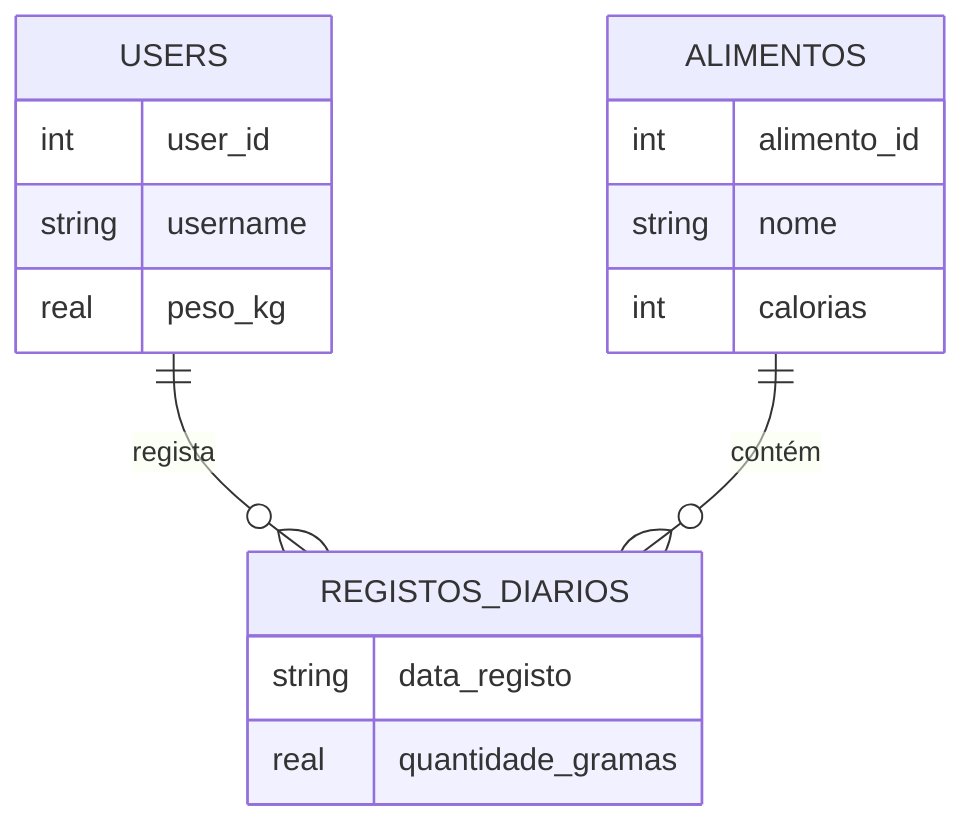

A Nutri App utiliza o motor **SQLite** para uma gestão de dados leve e eficiente.

### Porquê SQLite?
Como a nossa aplicação é focada na simplicidade, usamos o `sqlite3` nativo do Python. O ficheiro da base de dados vive em `data/nutricao.db`.

### 👤 Tabela: Users
Guarda os dados de login e as métricas corporais do utilizador.

| Coluna | Tipo | Notas |
| :--- | :--- | :--- |
| `user_id` | INTEGER | Primary Key (Auto) |
| `username` | TEXT | Único |
| `password_hash` | TEXT | Encriptado |
| `role` | TEXT | Default: 'user' |
| `peso_kg` | REAL | Peso atual |
| `altura_cm` | INTEGER | Altura em cm |
| `objetivo_calorias` | INTEGER | Meta diária |

### 🍎 Tabela: Alimentos
O nosso catálogo nutricional. Cada alimento tem os seus macros definidos por porção.

| Coluna | Tipo | Descrição |
| :--- | :--- | :--- |
| `alimento_id` | INTEGER | ID Sequencial |
| `nome` | TEXT | Nome único do prato |
| `calorias` | INTEGER | Kcal totais |
| `proteinas` | REAL | Gramas de proteína |
| `hidratos` | REAL | Gramas de hidratos |
| `gorduras` | REAL | Gramas de gordura |

### 📅 Tabela: registos_diarios
A tabela de ligação que cruza "Quem comeu" com "O que comeu".

| Coluna | Tipo | Relação |
| :--- | :--- | :--- |
| `user_id` | INTEGER | FK -> users |
| `alimento_id` | INTEGER | FK -> alimentos |
| `quantidade_gramas`| REAL | Porção ingerida |

### Diagrama ER

    
### Como nos ligamos?
Usamos a função `get_db_connection` para garantir que a pasta de dados existe e ligar o modo de dicionários:

```python
def get_db_connection():
    os.makedirs(DATA_DIR, exist_ok=True) # Cria a pasta data/ se não existir

    conn = sqlite3.connect(DB_PATH)
    conn.row_factory = sqlite3.Row # Permite aceder colunas por nome
    return conn
```

### Schema SQL
O nosso script cria as tabelas automaticamente se não existirem:
```sql
CREATE TABLE IF NOT EXISTS users (
    user_id INTEGER PRIMARY KEY AUTOINCREMENT,
    username TEXT UNIQUE NOT NULL,
    ...
);

