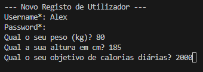
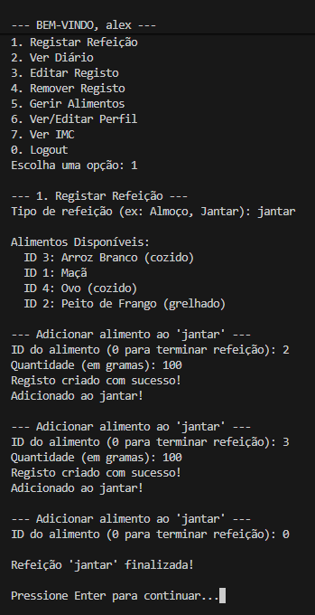
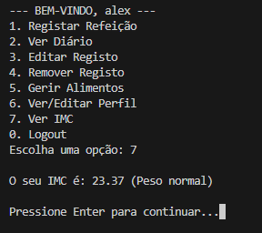
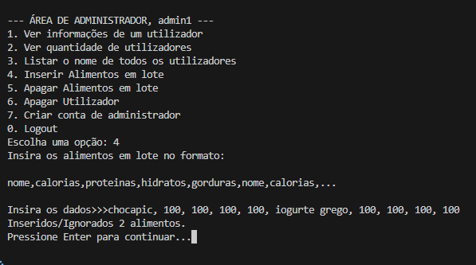
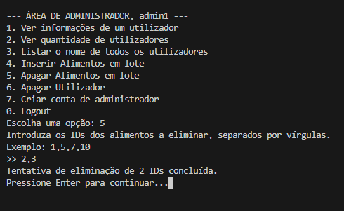
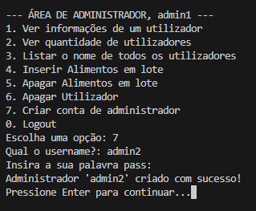

# 📖 Manual de Utilizador

Este guia explica como utilizar as principais funcionalidades do **NutriApp**.

## 1. Registo e Login

Ao iniciar a aplicação, serás recebido pelo menu principal.

1.  Selecione a opção **Registar Novo Utilizador** se for a primeira vez.
2.  Insira os dados solicitados:
    *   **Username e Password**
    *   **Peso (kg)** e **Altura (cm)**
    *   **Objetivo de calorias diárias**

Para entrar posteriormente, basta selecionar **Fazer Login** e introduzir as suas credenciais.

## 2. Diário Alimentar

O Diário Alimentar é o coração da aplicação. Aqui podes registar o que comeste ao longo do dia.

*   **Adicionar Refeição:** Escolhe um alimento da base de dados e a quantidade ingerida.
*   **Verificar Totais:** O sistema calcula automaticamente as calorias totais e compara com o teu objetivo diário.

> **Dica:** Tenta manter um equilíbrio entre os macronutrientes!

## 3. Gestão de Alimentos (Admin)

Utilizadores com permissões elevadas podem gerir a base de dados de alimentos:

*   **Criar:** Adicionar novos alimentos com tabela nutricional.
*   **Editar/Remover:** Atualizar informações de alimentos existentes.

## 4. Cálculo do IMC

O Índice de Massa Corporal (IMC) é calculado automaticamente com base no teu perfil. Podes consultar o teu estado atual (e.g., "Peso Normal", "Sobrepeso") no teu perfil.

---

## 5. Insert e delte em de alimentos em lote (Admin)

O plano Pro possibilita inserção e eleminação de alimentos em lote, o que providencia uma maior flexibilidade e rapidez de ação.

---

## 5. Criação de contas de administrador (Admin)

O plano Pro possibilita a criação de contas de administrador ilimitadas funcionalidade focada para empresas e ginásios (gestão distribuida).

---

Precisa de ajuda técnica? [Contacte o suporte](mailto:suporte@nutriapp.com) ou abra um *issue* no GitHub.
