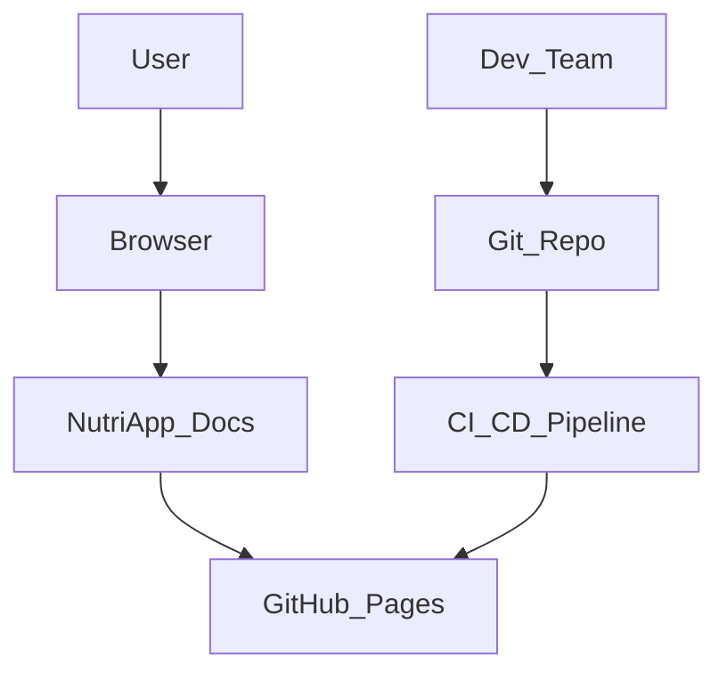

# 🏗️ Arquitetura do Sistema

## Tecnologias Utilizadas

O site de documentação do NutriApp é construído utilizando tecnologias modernas de desenvolvimento web:

*   **Docusaurus v3**: Framework de documentação estática baseada em React.
*   **React**: Biblioteca JS para construção de interfaces.
*   **Markdown (MDX)**: Para escrita de conteúdo rico.
*   **GitHub Pages**: Para alojamento e deployment contínuo.

## Decisões de Design

### Estilo e Tema
Utilizamos o tema clássico do Docusaurus com personalizações em `src/css/custom.css` para refletir a identidade visual do NutriApp (verde e saudável).

### Estrutura de Conteúdo
Optámos por separar o conteúdo em "Manual de Utilizador" (funcional) e "Wiki Técnica" (developer) para servir ambos os públicos alvo num só local.

## Diagrama de Conceito (Exemplo)

