# 🏗️ Arquitetura do Sistema

## Tecnologias Utilizadas

O site de documentação do NutriApp é construído utilizando tecnologias modernas de desenvolvimento web:

*   **Docusaurus v3**: Framework de documentação estática baseada em React.
*   **React**: Biblioteca JS para construção de interfaces.
*   **Markdown (MDX)**: Para escrita de conteúdo rico.
*   **GitHub Pages**: Para alojamento e deployment contínuo.

## Decisões de Design

### Estilo e Tema
Utilizamos o tema clássico do Docusaurus com personalizações em `src/css/custom.css` para refletir a identidade visual do NutriApp (verde e saudável).

### Estrutura de Conteúdo
Optámos por separar o conteúdo em "Manual de Utilizador" (funcional) e "Wiki Técnica" (developer) para servir ambos os públicos alvo num só local.

## Diagrama de Arquitetura do Sistema

```mermaid
graph TD;
    User[👤 Utilizador]-->Browser[🌐 Browser];
    Browser-->NutriApp_Docs[📚 NutriApp Docs];
    NutriApp_Docs-->GitHub_Pages[☁️ GitHub Pages];
    Dev_Team[👨‍💻 Equipa Dev]-->Git_Repo[📦 Git Repository];
    Git_Repo-->CI_CD_Pipeline[⚙️ CI/CD Pipeline];
    CI_CD_Pipeline-->GitHub_Pages;
    
    style User fill:#e1f5e1
    style Browser fill:#e3f2fd
    style NutriApp_Docs fill:#fff3e0
    style GitHub_Pages fill:#f3e5f5
```

## Fluxo de Desenvolvimento (Git Flow)

## Sequência de Autenticação (Exemplo)

```mermaid
sequenceDiagram
    participant U as User
    participant F as Frontend
    participant B as Backend
    participant DB as Database
    
    U->>F: Login (email, password)
    F->>B: POST /auth/login
    B->>DB: Query user by email
    DB-->>B: User data + hashed password
    B->>B: bcrypt.compare(password, hash)
    alt Password válida
        B-->>F: JWT Token
        F-->>U: Redirect to Dashboard
    else Password inválida
        B-->>F: 401 Unauthorized
        F-->>U: Erro: Credenciais inválidas
    end
```

