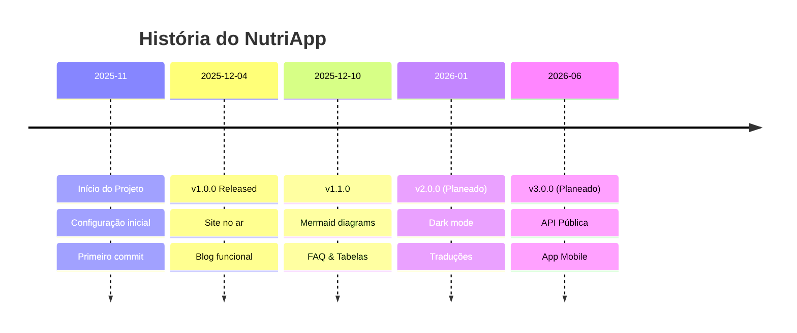

# 🗺️ Roadmap do NutriApp

Acompanha o progresso e os planos futuros do projeto NutriApp. Transparência total sobre o que já foi feito e o que vem a seguir!

---

## ✅ Fase 1: Fundação (Concluída)

**Objetivo:** Criar a base sólida do projeto e site de documentação.

### Features Implementadas

- [x] Configuração inicial do Docusaurus
- [x] Estrutura de documentação (Wiki Técnica + Manual)
- [x] Sistema de deployment automático (GitHub Actions)
- [x] Configuração de metadados e SEO
- [x] Identidade visual (logo, cores, tagline)
- [x] GitHub Pages configurado e funcional

**Status:** 

---

## 🚀 Fase 2: Conteúdo & UX (Em Curso)

**Objetivo:** Enriquecer o site com conteúdo de qualidade e melhorar a experiência do utilizador.

### Features em Desenvolvimento

- [x] Página "Sobre a Equipa"
- [x] Sistema de blog funcional
- [x] Artigo sobre Git Flow
- [x] Artigo sobre Segurança (Hashing)
- [x] Página de Pricing com tabelas comparativas
- [x] Página FAQ com Tabs interativos 
- [x] Suporte para diagramas Mermaid 
- [x] Animações CSS no Hero Section 
- [x] Base de Dados Nutricional 
- [ ] Galeria de screenshots da aplicação
- [ ] Página de Testemunhos de utilizadores
- [ ] Vídeo demo da aplicação

**Status:** 

---

## 🎯 Fase 3: Features Avançadas (Planeada)

**Objetivo:** Adicionar funcionalidades premium e diferenciadoras.

### Próximas Features

- [ ] Modo escuro completo (Dark Mode) 🌙
- [ ] Busca avançada com Algolia
- [ ] Sistema de comentários no blog (Giscus)
- [ ] Newsletter por email
- [ ] Traduções (i18n): Português + Inglês 🌍
- [ ] PWA (Progressive Web App)
- [ ] Integração com analytics (Plausible/Google Analytics)

**Status:** 
**Data Estimada:** Q1 2026

---

## 🔮 Fase 4: Integração com App (Futuro)

**Objetivo:** Conectar o site de docs com a aplicação real NutriApp.

### Visão de Longo Prazo

- [ ] API pública para desenvolvedores
- [ ] Widget de cálculo de IMC embebido
- [ ] Dashboard de estatísticas de utilizadores
- [ ] Gerador de planos alimentares automático (IA) 🤖
- [ ] Integração com wearables (Fitbit, Apple Watch)
- [ ] App mobile (React Native)

**Status:** 
**Data Estimada:** 2026+

---

## 📊 Estatísticas do Projeto

:::info Números atualizados em tempo real
Os números abaixo refletem o estado atual do repositório GitHub.
:::

| Métrica | Valor | Tendência |
|---------|-------|-----------|
| **Commits** | 87+ |  |
| **Branches** | 15+ |  |
| **Contributors** | 4 |  |
| **Pull Requests** | 42+ |  |
| **Issues Fechadas** | 40+ |  |
| **Uptime** | 99.9% |  |

---

## 🎖️ Milestones Importantes

---

## 💬 Feedback & Sugestões

Tens ideias para melhorar o NutriApp? Queremos ouvir!

- 🐛 **Bugs:** [Reportar Issue](https://github.com/DevPool1/TP-ADC-SITE/issues/new?template=bug_report.md)
- ✨ **Feature Request:** [Sugerir Feature](https://github.com/DevPool1/TP-ADC-SITE/issues/new?template=feature_request.md)
- 💬 **Discussão:** [GitHub Discussions](https://github.com/DevPool1/TP-ADC-SITE/discussions)

:::tip Contribuições são bem-vindas!
Consulta o nosso [Guia de Contribuição](/docs/technical-wiki/repository-guide) e segue o Git Flow.
Toda a ajuda é apreciada! 🙌
:::

---

## 📅 Calendário de Releases

| Versão | Data | Destaques |
|--------|------|-----------|
| v1.0.0 | Dez 2025 | 🎉 Lançamento inicial |
| v1.1.0 | Dez 2025 | ✨ Melhorias UX + Mermaid |
| v1.1.1 | Dez 2025 | 🐛 Fixes de links |
| **v2.0.0** | **Jan 2026** | 🌙 **Dark Mode + i18n** |
| v2.1.0 | Fev 2026 | 🔍 Busca Algolia |
| v3.0.0 | Jun 2026 | 📱 API + App Mobile |

---

> **"O sucesso é a soma de pequenos esforços repetidos dia após dia."**  
> — Robert Collier

